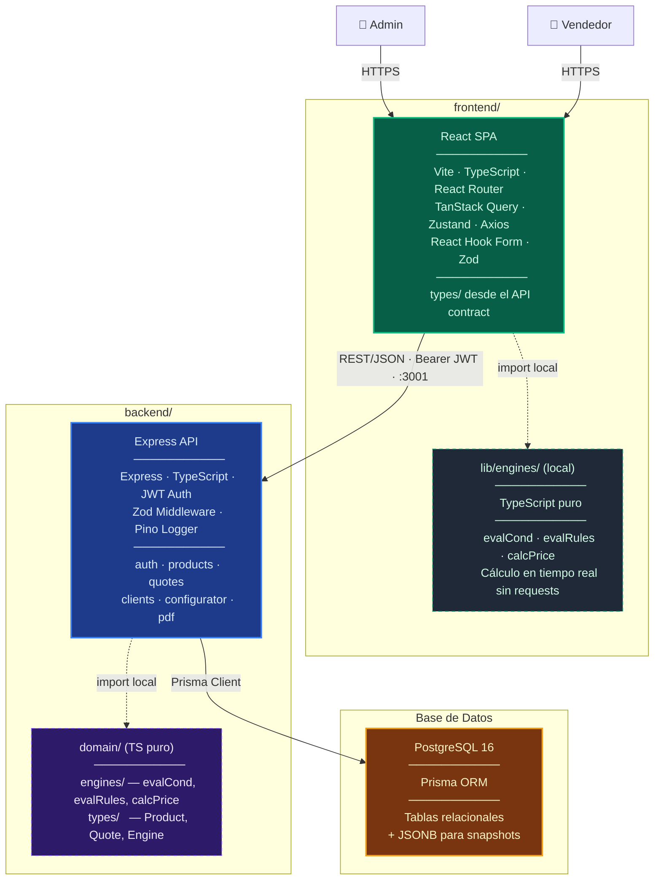

# ⚡ CPQ Engine — Configure, Price, Quote

> Sistema web para empresas con productos configurables: arma cotizaciones paso a paso con reglas de compatibilidad y precios en tiempo real.

---

## ¿Qué es?

**CPQ Engine** es un sistema web de tipo Configure, Price, Quote diseñado para empresas que venden productos configurables — como servidores, pólizas de seguro, o licencias de software. El problema que resuelve es claro: sin una herramienta CPQ, los vendedores arman cotizaciones manualmente, el proceso es lento, propenso a errores, y las combinaciones inválidas pasan desapercibidas hasta que es demasiado tarde.

---

## Arquitectura

---

## Stack Tecnológico

| Capa | Tecnología |
|------|-----------|
| **Backend** | Node.js · Express · TypeScript · Prisma ORM |
| **Frontend** | React · Vite · TypeScript · React Router |
| **Base de Datos** | PostgreSQL (relacional + JSONB para snapshots) |
| **Validación** | Zod |
| **Auth** | JWT |
| **Testing** | Vitest |
| **Logging** | Pino |
